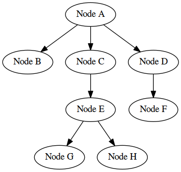

# Assignment 3
**Due by 11:59pm on Monday, 3/12/2018**

**Demo due by 11:59pm on Friday, 3/23/2018**

In this assignment, we'll work on generating an intermediate representation for a source program, to be passed on to later phases of the compiler.  Specifically, we'll modify out Python parser from assignment 2 to generate an abstract syntax tree (AST) representing the source program.  In addition, we'll take a first stab at generating code using this AST by generating a GraphViz specification of the AST itself.  This will enable us to visualize the AST.

There are a few major parts to this assignment, described below.  To get you started, you are provided with a Flex scanner specification in `scanner.l` and a Bison parser specification in `parser.y` that, together with the `main()` function in `main.cpp`, solve the problem defined in assignment 2.  There is also a makefile that specifies compilation for the parser.  Instead of using these files, you may also start with your own solution to assignment 2, if you'd like.

## 1. Implement one or more data structures for building an AST

An abstract syntax tree (AST) is a tree-based representation of the source program.  It closely resembles a parse tree but is more compact because it eliminates or contracts many of the nodes corresponding to nonterminals.  You can see visualizations of example ASTs in the `example_output/` directory.

Your first task in this assignment is to implement a set of one or more data structures that allow you to construct an AST for a source program written in the same subset of Python we worked with for assignment 2.  To do this, you'll have to figure out what specific language constructs need to be represented by an AST node, what data might be associated with each of these nodes, and how each type of node connects to other nodes in the AST.

For example, you might write a class or structure to represent an AST node corresponding to a binary expression (e.g. `expr OP expr`) in the source language.  Your class/structure might contain a field to represent the specific operator associated with the expression, and it might contain two pointers to other AST nodes, one representing the left-hand side of the binary expression and another representing the right-hand side of the binary expression.  These LHS and RHS nodes might have additional children, or they could represent identifiers, floats, integers, etc. that have no children.  Moreover, you might also have classes/structures for nodes representing higher-level language constructs, such as assignment statements.  The binary expression node would be a child of one of these higher-level nodes.

## 2. Modify the parser to use your data structures to build an AST

Your next task is to modify the parser to build an AST using the data structures you defined above.  The general idea here is to modify the action associated with each of the parser's grammar rules to return an AST node instead of returning a string of C++ code.

Though the end goal is different, the mechanics of this will be similar to generating a C++ translation.  In particular, to generate a string containing C++ translation for the language construct on the left-hand side of a particular grammar rule, you assumed that you had C++ strings for the language constructs on the right-hand side of the rule (specifically in `$n`), and you concatenated these together (along with proper punctuation, etc.) to form the left-hand side's C++ string (i.e. `$$`).

Similarly, when building an AST node for a language construct on the left-hand side of a grammar rule, you should assume that you have AST nodes for the relevant language constructs on the right-hand side of the rule (in `$n`), and you can use these to generate the node for the left-hand side construct (i.e. `$$`).  For example, you could pass the `$n`'s to a function or class constructor that generates a node for the left-hand-side language construct and then assign that generated node to `$$`.

You'll have to do a few other things in the parser to get this all working, as well.  For example, the current parser uses the type `std::string*` for all grammar symbols.  You'll instead have to use the appropriate AST node class/structure type for each nonterminal symbol.  You'll likely want to continue to represent all terminals with `std::string*`.  The scanner may need very minor changes to make this work.

Once you have the parser building your AST, save the root node of the AST in a global variable, similar to the way the current parser saves the entire translated program string in a global variable.  If you'd like, you can modify the `main()` function to print out some information about the AST using this global variable.

## 3. Use your AST to generate a GraphViz specification to visualize the AST

Finally, to get practice generating code from an AST, implement functionality to use your AST to generate its own [GraphViz](http://www.graphviz.org/) specification.  You should specifically write a specification that can be passed to the [`dot`](https://graphviz.gitlab.io/_pages/pdf/dotguide.pdf) program (which is installed on the ENGR servers) to generate a visualization of the AST.

GraphViz uses a very simple notation for representing trees and graphs.  Here's an example of a simple GraphViz tree specification:
```
digraph G {
  a [label="Node A"];
  b [label="Node B"];
  c [label="Node C"];
  d [label="Node D"];
  e [label="Node E"];
  f [label="Node F"];
  g [label="Node G"];
  h [label="Node H"];

  a -> b;
  a -> c;
  a -> d;
  c -> e;
  d -> f;
  e -> g;
  e -> h;
}
```
Assuming this file was named `tree.gv`, we could use it to generate a PNG image visualizing the specified tree with the following command:
```
dot -Tpng -otree.png tree.gv
```
This is the image that would be produced (in `tree.png`):



The GraphViz specification is flexible, and nodes and edges can be defined in any order.  More info on additional visualization options is available in the documentation linked above.

To generate a GraphViz specification for your AST, you should write functions that generate GraphViz code for each of your AST node classes/structures (one function per class/structure).  Each of these functions should generate the relevant GraphViz code for the node itself (e.g. a label for the node indicating the language construct it represents and specifications of the edges to the node's children).  They should then recursively call other functions to generate GraphViz code for each of the node's children.  The practice of recursively traversing the AST in this way to generate GraphViz code closely resembles the way assembly code is generated from an AST, e.g. using LLVM.

Two primary design considerations when writing your traversal/code generation functions will be how to ensure that each AST node is given a unique identifier in the GraphViz specification and how to concatenate together all of the GraphViz code produced for the individual AST nodes.

You should use your code generation functions by invoking them on the root node of the AST from your `main()` function, and you should output the generated GraphViz code to stdout, so it can be inspected or saved to a file.

## Testing your code

There are some simple Python programs you may use for testing your AST builder included in the `testing_code/` directory.  Example outputs (both a `.png` visualization and a `.gv` GraphView specification) for these programs are included in the `example_output/` directory.  Note that the ASTs your parser generates may be slightly different than the ones included here, depending on how you choose to represent nodes in the AST.  This is OK.

## Submission

We'll be using GitHub Classroom for this assignment, and you will submit your assignment via GitHub.  Make sure your completed files are committed and pushed by the assignment's deadline to the master branch of the GitHub repo that was created for you by GitHub Classroom.  A good way to check whether your files are safely submitted is to look at the master branch your assignment repo on the github.com website (i.e. https://github.com/OSU-CS480-W18/assignment-3-YourGitHubUsername/). If your changes show up there, you can consider your files submitted.

## Grading criteria

The TAs will grade your assignment by compiling and running it on one of the ENGR servers, e.g. `flip.engr.oregonstate.edu`, so you should make sure your code works as expected there.  `bison` and `flex` are installed on the ENGR servers (as is `dot`).  If your code does not compile and run on the ENGR servers, the TAs will deduct at least 25 points from your score.

This assignment is worth 100 points total, broken down as follows:
  * 25 points: a set of classes/structures is defined for representing an AST of the relevant subset of Python
  * 50 points: the parser/scanner are modified to build an AST from the source program using these classes/structures
  * 25 points: your compiler outputs a GraphViz specification of the constructed AST
